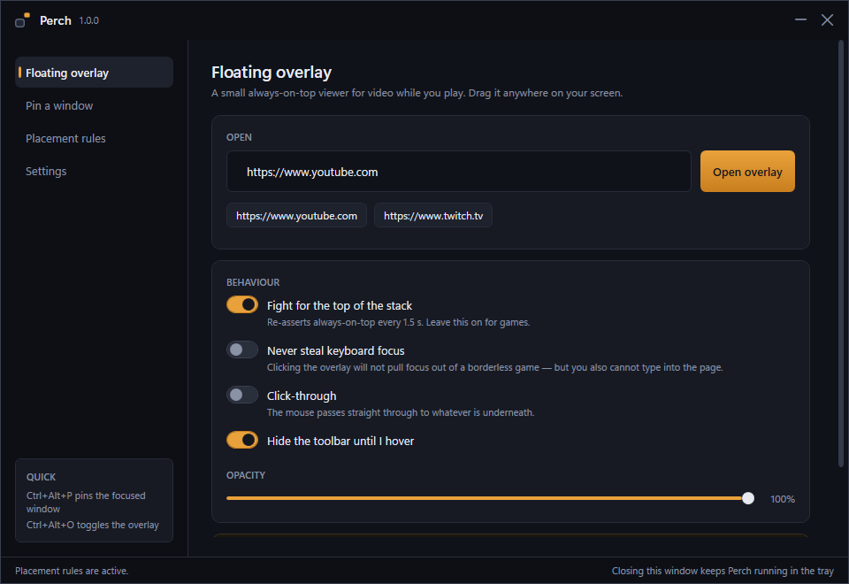

# Perch

**Keep any window on top, and make your apps open where they belong.**

Perch is a small Windows tray app that does two things well:

1. **A floating overlay.** A borderless always-on-top viewer for YouTube, Twitch or any
   other page, sized and placed wherever you want it — so you can watch something while
   you play. Adjustable opacity, click-through, and a toolbar that hides until you hover.
2. **Placement rules.** Send an app to the monitor it belongs on, every time it opens.
   *Discord, maximised, on monitor 2* — set it once and stop dragging windows around.

Built for wide and multi-monitor desktops, where there is plenty of screen left over
while a game runs.



---

## Install

Download `Perch.exe` from the [latest release](../../releases/latest) and run it. There is
no installer and nothing to set up: Perch lives in the tray, and its settings go in
`%APPDATA%\Perch\config.json`.

The built-in viewer uses the Microsoft Edge **WebView2 Runtime**, which ships with
Windows 10 and 11. If it is missing, Perch says so and everything else still works.

## Using it

### The overlay

Open the **Floating overlay** tab, put in an address, and press **Open overlay**.
Drag it by the grip on the left of its toolbar, resize it from any edge.

| Setting | What it does |
| --- | --- |
| Fight for the top of the stack | Re-asserts always-on-top every 1.5 s. Some games grab the top of the z-order for themselves; this takes it back. |
| Never steal keyboard focus | Clicking the overlay will not pull focus out of a borderless game. You also cannot type into the page while it is on. |
| Click-through | The mouse passes straight through to whatever is underneath. Toggle it back with the shortcut. |
| Opacity | Fade the overlay down so you can see through it. |

### Pinning a window you already have

Focus any window and press **Ctrl+Alt+P**. That window now stays above everything else.
Press it again to release. The **Pin a window** tab lists everything that is open if you
would rather click.

### Placement rules

**Placement rules → New rule**, pick the app from the list of what is running, choose a
monitor and whether it should be maximised. From then on, every window that app opens
lands there.

Rules match on the process name (`Discord`, `chrome`, `Spotify`) with an optional filter
on the window title, for apps that open several different windows.

## Shortcuts

| Shortcut | Action |
| --- | --- |
| `Ctrl+Alt+P` | Pin / unpin the focused window |
| `Ctrl+Alt+O` | Show or hide the overlay |
| `Ctrl+Alt+C` | Toggle click-through |
| `Ctrl+Alt+↑` / `↓` | More or less opaque |

All of them are rebindable under **Settings**. They work while a game has focus.

## What Perch cannot do

**Exclusive full-screen.** When a game takes the display in exclusive full-screen mode,
Windows hands the whole output over to it and hides every other window. No application
can draw over that without hooking into the game's renderer — which is exactly what
anti-cheat software is built to catch, so Perch does not go there.

**Set your game to Borderless (or Windowed) and the overlay works.** Nearly every modern
game offers it, and on a fast machine the difference in performance is negligible.

**DRM video.** Netflix, Disney+ and similar rely on Widevine, which the WebView2 runtime
does not carry. YouTube, Twitch, and ordinary web video are fine.

## Building it yourself

Requires the [.NET 9 SDK](https://dotnet.microsoft.com/download).

```bash
dotnet build src/Perch/Perch.csproj -c Release
```

For a single self-contained `Perch.exe` that runs without .NET installed:

```bash
dotnet publish src/Perch/Perch.csproj -c Release -r win-x64 --self-contained true -p:PublishSingleFile=true -p:IncludeNativeLibrariesForSelfExtract=true
```

### Layout

```
src/Perch/
  Interop/      P/Invoke and the "is this a real window?" rules
  Models/       Config shapes
  Services/     Pinning, placement rules, hotkeys, monitors, tray, config
  Views/        WPF windows (main, overlay, rule editor, app picker)
  Assets/       Theme and icon
```

The parts worth knowing about:

- **`WindowRuleService`** hooks `EVENT_OBJECT_SHOW` and re-applies each match on a short
  retry schedule. Applying once loses a race with apps that restore their own saved
  layout a beat after the window appears.
- **`PinService`** re-asserts topmost on a timer rather than setting it once.
- **`OverlayWindow`** is layered (`WS_EX_LAYERED`) rather than using WPF's
  `AllowsTransparency`, because WebView2 cannot render into a transparent WPF window.

## Licence

[MIT](LICENSE)
