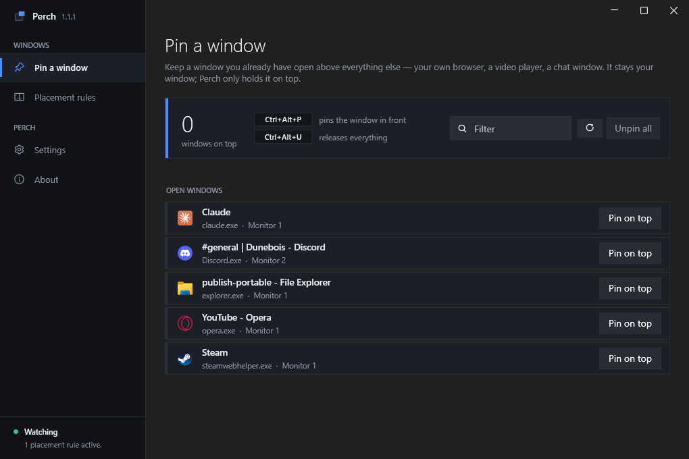
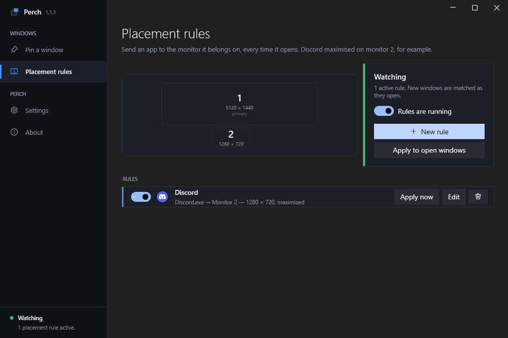
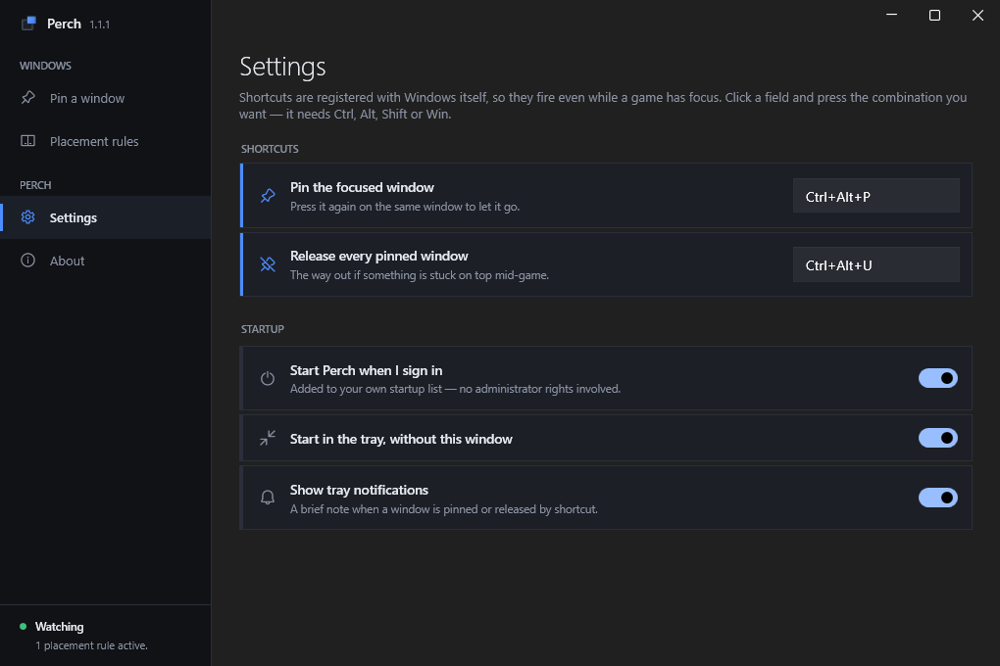

# Perch

**Hold a window above the rest, and make your apps open on the screen they belong on.**

Two things, for people with a wide or multi-monitor desk:

- **Pin any window on top.** Press `Ctrl+Alt+P` and whatever window is in front stays above
  everything else — your own browser playing a video, a chat window, a wiki page. It stays
  *your* window; Perch only holds it there.
- **Placement rules.** *Discord, maximised, on monitor 2.* Set it once, and every window
  that app opens lands there from then on.

Perch lives in the tray, uses no measurable CPU while it waits, and touches nothing except
window positions.



---

## Getting it

Download **`PerchSetup-x.y.z.exe`** from the [latest release](../../releases/latest) and run it.

It installs into your own profile, so Windows never asks for administrator rights, and it
appears in Settings → Apps like anything else. There is also a portable **`Perch.exe`** in
the same release if you would rather not install anything.

SmartScreen will warn you the first time, because the build is not code-signed — a
certificate costs a few hundred euros a year. Choose **More info → Run anyway**, or build it
yourself from source with the steps at the bottom.

Windows 10 (1809 or newer) and Windows 11, 64-bit. Nothing else to install.

## What it looks like

| | |
|---|---|
|  |  |
| **Placement rules.** The map is your actual desk, drawn to scale — you click the screen you mean rather than guessing which one "monitor 2" is. | **Settings.** Two shortcuts, registered with Windows itself so they fire while a game has focus. Startup goes in your own Run key, not a scheduled task. |

## What it does

| | |
|---|---|
| **Pin a window** | Everything you have open, with its real icon and which monitor it is on. Pin from the list or with the shortcut. Perch re-asserts the pin every two seconds, because Windows drops a window out of the topmost band whenever a full-screen app claims that spot. |
| **Placement rules** | Match on process name (`Discord`, `chrome`, `Spotify`), optionally narrowed by window title for apps that open several kinds of window. Choose a monitor from the map, and whether the window should be maximised, windowed and centred, or minimised. Optionally hold it on top too. |
| **Shortcuts** | `Ctrl+Alt+P` pins the focused window, `Ctrl+Alt+U` releases everything. Both rebindable. |
| **Tray** | Closing the window keeps Perch running. Right-click the tray icon to open it, unpin everything, or quit. |

Settings live in `%APPDATA%\Perch\config.json` as plain JSON. The uninstaller offers to
remove them; it never does so silently.

### Why the rules retry

Most apps create their window, then move and resize it a beat later while they restore
their own saved layout. Applying a rule once, on the show event, loses that race — the app
puts the window back. Perch re-applies each match on a short schedule (0, 250, 700, 1500 and
2500 ms) until the app has settled, then leaves it alone so you can still move it yourself.

## What it cannot do

**Exclusive full-screen games.** When a game takes the display in exclusive full-screen,
Windows hands the whole output to it and hides every other window. Nothing can draw over
that without hooking into the game's renderer, which is exactly what anti-cheat software is
built to catch — so Perch does not go there. **Set the game to Borderless** and pinning
works; nearly every modern game offers it, and the cost in frame rate is negligible.

**Windows owned by administrator processes.** Perch runs as you. Windows does not let an
ordinary program reposition a window owned by an elevated process, so those rows simply will
not respond. Running Perch as administrator would fix it and is not worth it for this.

**A see-through overlay.** Earlier versions shipped a built-in browser window with an opacity
slider. It never worked: fading a window needs `WS_EX_LAYERED`, WPF clears that style on any
window it did not make transparent itself, and the supported alternative cannot render a
browser control at all. The whole feature was removed in 2.0 rather than left there looking
functional. Pin your own browser window instead.

## Building it

Requires the [.NET 9 SDK](https://dotnet.microsoft.com/download).

```bash
dotnet build src/Perch/Perch.csproj -c Release
```

For the installer and the portable build, which is what a release ships:

```powershell
winget install JRSoftware.InnoSetup
./installer/build-installer.ps1
```

Both land in `dist/`.

### How it is put together

```
src/Perch/
  Interop/        P/Invoke, and the rules for what counts as a real window
  Models/         Config shapes
  Services/       Pinning, placement rules, hotkeys, monitors, icons, tray, config
  Views/          Main window and the rule dialogs
  Views/Pages/    Pin, Rules, Settings, About
  Views/Controls/ The monitor map
installer/        Inno Setup script and the build script that drives it
```

The parts worth knowing about:

- **`WindowRuleService`** hooks `EVENT_OBJECT_SHOW` and re-applies each match on the retry
  schedule described above.
- **`PinService`** re-asserts topmost on a timer, and treats a window that is already in the
  topmost band as pinned — so a window left behind by a killed Perch can still be released.
- **`StartupService`** compares the whole Run command rather than just checking that an entry
  exists, so installing or moving Perch does not leave autostart pointing at a stale path.
- **`MonitorService`** matches a saved monitor by device name first and falls back to
  position, so rules survive a display being unplugged and plugged back in.

The interface is [WPF-UI](https://github.com/lepoco/wpfui) repainted to match
[Brisk](https://github.com/MatternPL/Brisk) — same palette, same square edges, same blue.

## Licence

[MIT](LICENSE)
